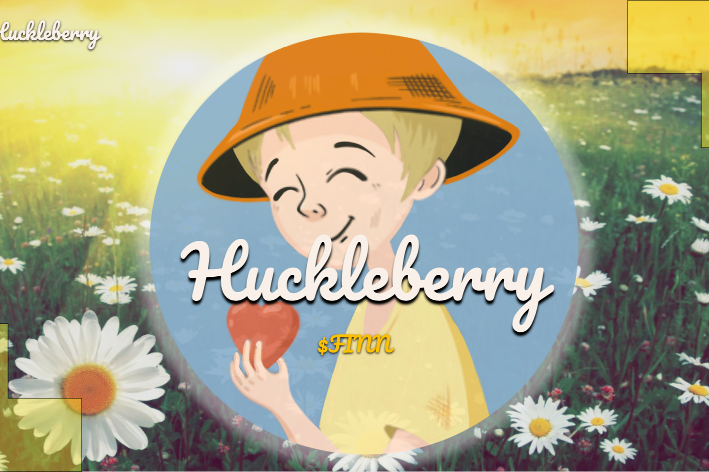

Huckleberry 是一个基于 Moonriver 的社区驱动的 AMM 跨链 DEX 和借贷平台。我们所做的一切都是社区驱动的，这允许所有用户对 DEX 的未来方向有发言权。
Huckleberry 的基本功能
交换🔄
通过我们的自动做市商 (AMM) 跨链交易所在代币之间进行交易。
被动航行🚣
$FINN 是一种反映代币，这意味着每笔 $FINN 交易的 1% 会自动在所有 $FINN 持有者之间共享，与他们的持有量成正比。
河流🏞
将 LP 代币质押到 Rivers 并获得 $FINN 作为回报。这是哈克贝利对高产农业的看法。
汤姆的家  
质押 $FINN 即可获得 $TOM。由于支持 $TOM 的 $FINN 池不断增长，这要归功于 Passive Sailin、Huckleberry 的 DEX 费用的一部分和 Thatcher 的 Reservoir 的借贷协议费用的一部分，$TOM 每天价值更多的 $FINN 代币。
远足🏕
质押 $TOM 以赚取 $FINN 和其他代币。没有无常的损失！
撒切尔水库🏦
存款和借入资产。这是 Huckleberry 的 Lendin' 平台。

