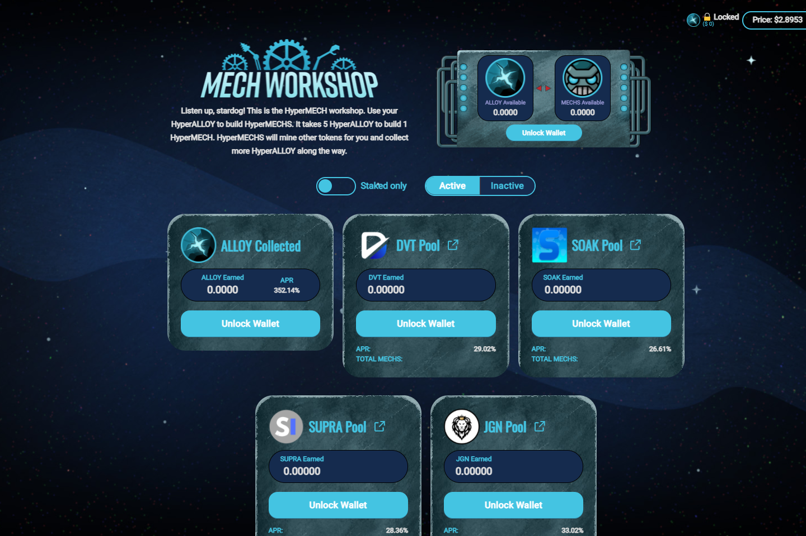

HyperBurn (HYPR) 50% 分配给持有人钱包 25% 永远耗尽总供应量 25% 分配给烧毁金库用于开发 HyperAlloy (ALLOY) 排放量：每块 3.14 回购并燃烧 0.1% 的 AMM 费用 回购并燃烧收益农场存款费
HyperJump 生态系统
HyperJump 是一个 DeFi 协议，在币安智能链 (BSC) 上有一个有趣的代币生态系统。该生态系统围绕 NFT、游戏和代币经济学构建，这将使最终用户受益。
我们的代币：
购买后每笔交易都会烧掉的通货紧缩代币。燃烧率基于与 BNB 价格的曲线。最高比率为 33%，最低比率为 0.5%。 “烧”分为三部分：
我们对小行星田产量农场的奖励代币。它也可以在 The Mech 工坊中转换为 MECHS，以获得合作伙伴代币以及更多合金。

