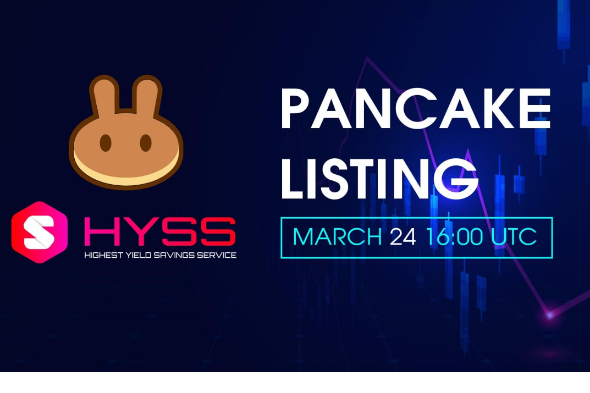

HYSS 提供去中心化金融资产，通过使用其独特的 HYSS 协议，以可持续的固定复利模型奖励持有者。
HYSS 简单的买入持有收益系统提供加密货币中最高的固定 APY，每 15 分钟复利一次，让您的 $HYSS 投资组合以指数速度增长。

最高收益储蓄服务
加密货币中最高的固定 APY – 499,997.79%

投资 1000 美元 - 以 499,997.79% APY 赚取高达 4,999,977.9 美元

