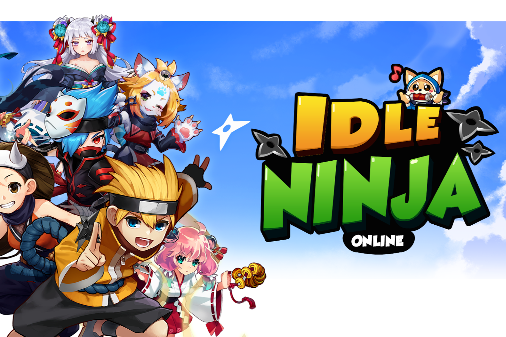

Idle Ninja Online 是韩国排名第一的基于区块链的 P2E 移动 RPG，玩家可以在其中培养忍者并体验独特的空闲和动作游戏风格。 INO 实施了自己的代币（NINKY）和 NFT（INARI），以进一步将 INO 世界与区块链系统交织在一起。该游戏于 2021 年 4 月推出，目前全球总下载量为 100 万次，活跃用户超过 21 万。随着游戏本身的快速发展，它正在全球范围内创建一个快速发展的社区，并为成功的数字娱乐项目铺平道路。

