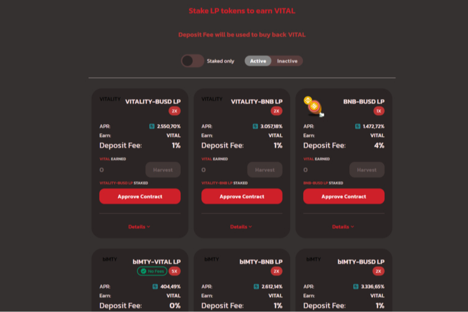

什么是免疫交换？

免疫交换第一个旨在改善全球健康状况同时为投资者创造收益的 DeFi 项目。ImmunitySwap 旨在通过将部分收入捐赠给应对持续健康危机的全球慈善机构来改善全球健康状况。 原生代币 (Immunity Token - $IMTY) 的总供应量是不可铸造的，与世界人口的数量相等，并且取决于焦点疾病（目前是 COVID-19）而被烧毁。

农民不仅为自己赚取活力代币，而且通过这样做，他们在有形的全球范围内为人们的健康做出了贡献。

