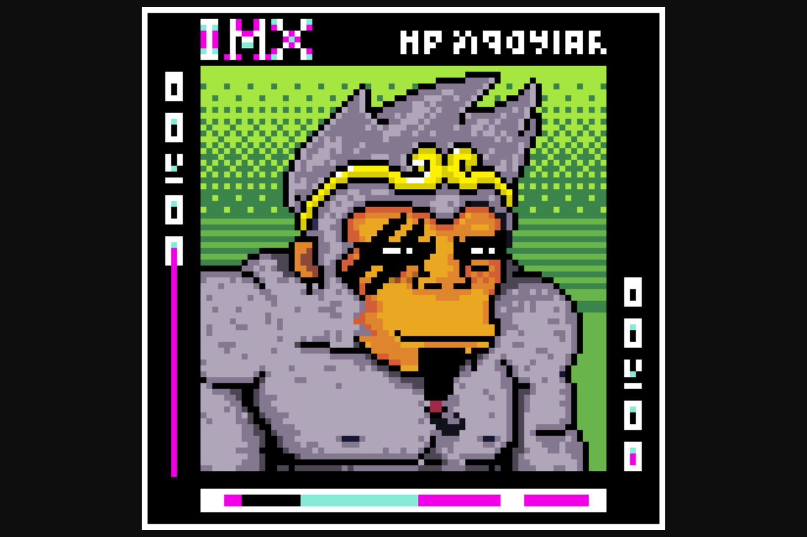

Immutable KongZ 是 2266 个数字 ERC-721 NFT 收藏品的集合，这些收藏品存在于 Layer2 以太坊区块链 Immutable X 上。

每个 KongZ 都是以编程方式生成的，并且将具有一组独特的随机特征，用于不同的稀有度。稀有度的详细信息将在铸币厂后公布。 KongZ 是 Immutable KongZ 家族的 GEN1，而这些生物将成为您访问独家 NFT 掉落和实用世界的通证。 Immutable X 使用 StarkWare 的 StarkEx 零知识证明技术在以太坊上实现可扩展性，同时为游戏开发者提供零燃料费和碳中和环境。

