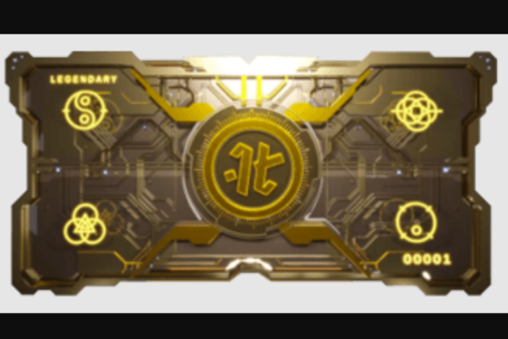

我们的使命是通过故事向人们介绍大规模的想法。除了 Project Kyzen 和 Merry Modz，我们目前还有一整套故事正在开发中。我们的项目有几种不同的方式来实现，但最常见的方式是从漫画书开始。
这将使我们能够在建立观众群时探索世界和故事。我们的两个项目已经以这种方式取得了成功（Neon Future 和 Hexagon）。这两个项目都在 Webtoon 上各自类别的前 10 名中度过了整个过程——总共获得了超过一百万的浏览量。

