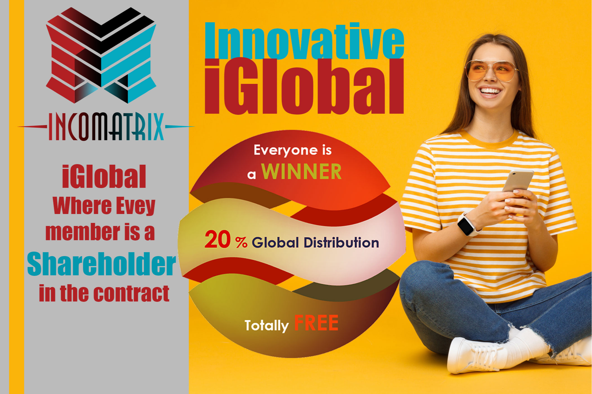

IncoMatrix 有史以来第一个 TRON 智能合约 - 众包 Tron 智能合约 - 具有最高的可持续性。 Incomatrix 由最强大的系统合二为一 IncoMatrix 是一个投资基金。 它基于 TRON 区块链。 这意味着，它接受 TRX 硬币形式的投资。 该项目是社区驱动的。 IncoMatrix 的合同已经过审计和检查。

Iglobal 分布于所有成员 20%    投资回报计划
强大的矩阵系统 i3 & i4     自动系统 Ai3 & Ai4
全球溢出矩阵 i16。   提取时，25% 会自动重新投资。   这一切只需要 75 TRX。

