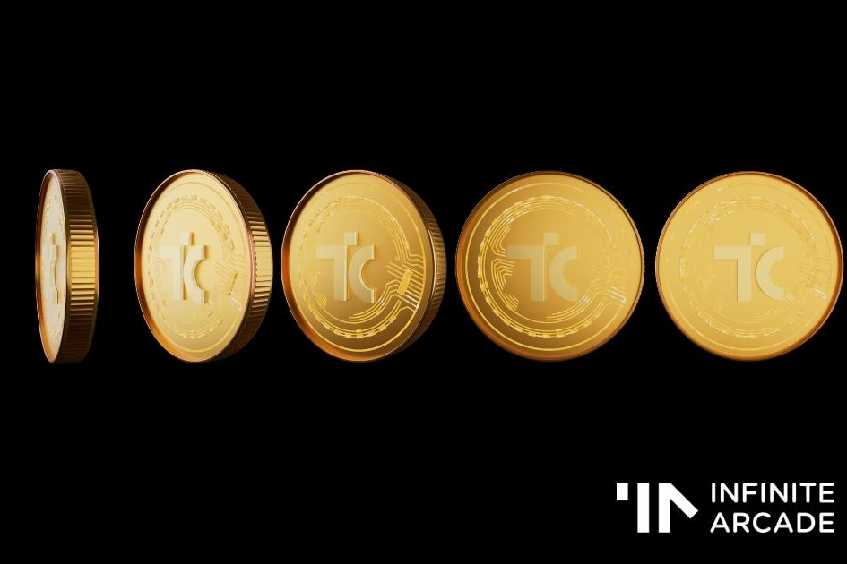

Infinite Arcade 中的游戏更好。 Infinite Arcade 是建立在庞大的手机游戏世界之上的元宇宙游戏体验。它赋予了额外的乐趣，让玩家能够使用他们独特的 NFT 角色进行游戏，获得现实世界的奖励，在锦标赛和对决中与朋友竞争，并拥有令人惊叹的手机游戏行业的一部分。 Infinite Arcade 为移动游戏开发者提供了一种利用 web3 功能和社区来吸引新玩家、提高游戏参与度并赚取更多收入的简单方法。 Infinite Arcade 经济运行在 $TIC 上，这是一种 ERC-20 实用代币，目前在 QuickSwap 上运行。 Infinite Arcade 将由 2022 年底推出的 $ARC 治理代币管理。

