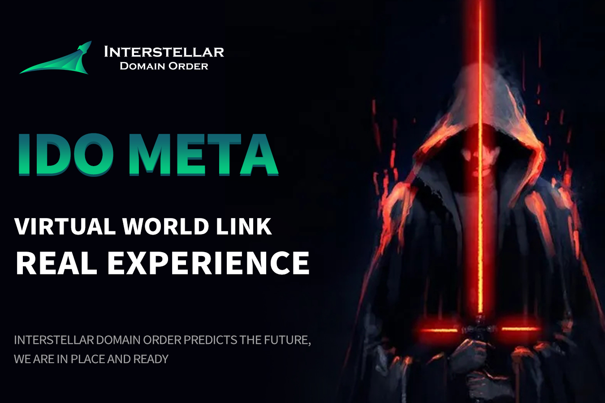

星际域订单总数为210亿，链中每笔交易被破坏5%，达到2100万。煎饼WAP LP移动池的底部仓库一直被锁定到2140年。IDO是整个星际域秩序生态学中唯一的循环令牌。在游戏中Fi
星际域订单总数为210亿，链中每笔交易被破坏5%，达到2100万。煎饼WAP LP移动池的底部仓库一直被锁定到2140年。IDO是整个星际域秩序生态学中唯一的循环令牌。在GameFi生态系统中，IDO可以购买星际战舰、太空宠物和植物，或者通过购买IDO代币参与星战，从而获得星级奖励BTC。未来，星际域秩序的生态系统将爆发出难以想象的。IDO是币安智能链最安全的代币合约销毁机制之一，也是BSCscan中最强大的生态系统蓝图。

