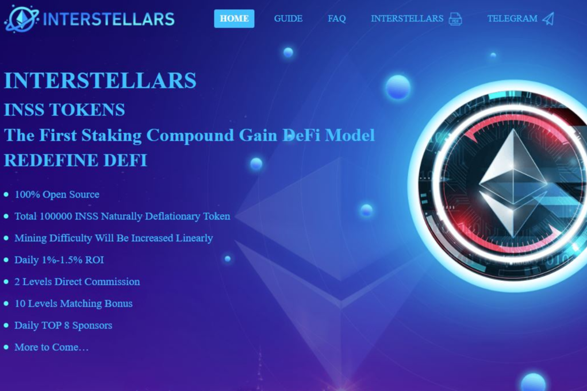

什么是间歇期？
INTERSTELLARS是一个基于以太坊智能合约和区块链技术的100%完全分散的透明金融基金。该基金没有所有者或人为控制，并保证所有参与者的公平性与该智能合约的规则

您在INTERSTELLARS系统中有双重奖励：&nbsp;

1）&nbsp;&nbsp;我们提供6种类型的质押池，根据所选的质押池，您将获得每日被动收入的1%-1.5%。&nbsp;

2）&nbsp;&nbsp;您将收到铸造INSS令牌，该令牌将在未来的inss.finance生态系统中使用。

