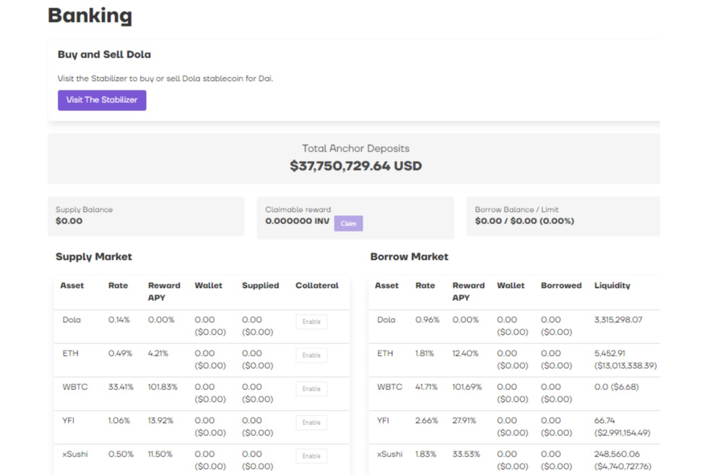

Inverse.finance 是一套无需许可的去中心化金融工具，由运行在以太坊区块链上的去中心化自治组织 Inverse DAO 管理。 Inverse.finance 的主要产品是 Anchor、DOLA 和 DCA Vaults

我们是澳大利亚第一个基于人工智能的贷款比较平台。 使用数据驱动的专有技术，我们可以为您预先批准来自 60 多家银行和贷方的最具竞争力的贷款，根据您的个人情况进行个性化设置。

寻找金融并不好玩，这就是为什么我们不仅让它变得更聪明，而且更简化了流程。

向我们申请时，您可以选择通过我们的网站进行自助服务，使用我们的 AI 聊天机器人，或与我们的一位贷款专家交谈，他们将指导您完成整个过程。

