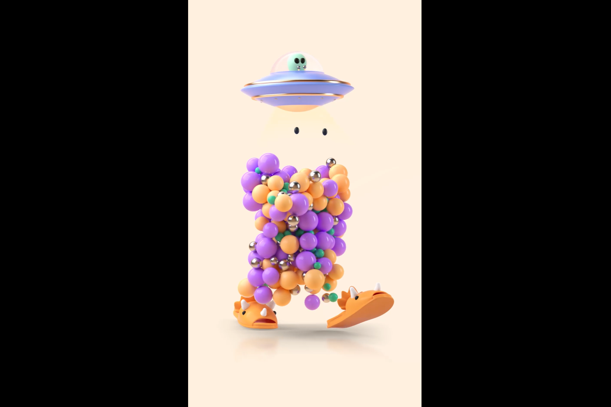

Imaginary Ones 是一个令人愉快的 3D 动画艺术，包含 8888 个独特的 NFT。 Imaginary Ones 希望重新点燃您的火花，拥抱创造力并为您的梦想而努力。 欢迎来到想象世界，那里没有太疯狂的想法，也没有太愚蠢的梦想。 让我们想象一下。 一起。

Imaginary Ones 是一种令人愉悦的 3D 艺术作品，最初在以太坊网络上投放了 8888 个独特的 NFT。
该项目相信用艺术来传播爱、积极性和创造力。
‍由新加坡著名艺术家 Cmttat 创作。
Imaginary Ones 背后的团队拥有十多年的合作经验
客户如耐克、苹果、三星、喜力、Spotify、欧莱雅等。

