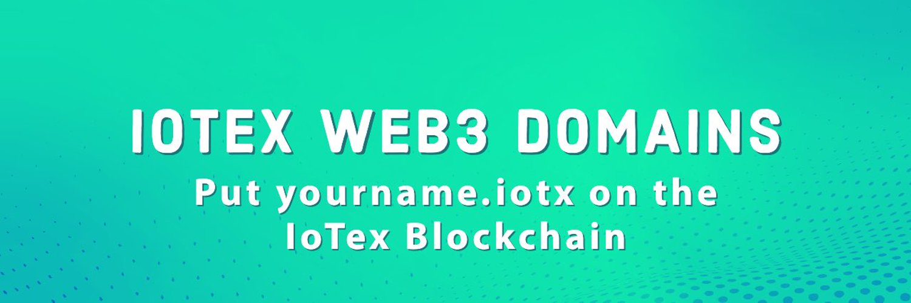

IoTeX Web3 域
使用 .iotx 域在区块链上构建身份
轻松分享
忘记必须不断复制和粘贴的长地址。改为分享您的 .iotx 域名！
简单交易
对于接收者来说，“将其发送到 hello.iotx”而不是记住或读出 42 个字符的代码。
您的完全控制
.iotx 域是 ERC-721 (NFT)。您的域安全地存储在您的钱包中，只有您可以管理和移动它们。
安全可靠
经过审计的智能合约确保向 .iotx 域汇款与向常规地址汇款一样安全。
第三者
将 .iotx 域集成到您的项目中。它使您的钱包和 Dapp 更加用户友好。
跨链
轻松在不同区块链平台（EVM）之间转移 .iotx 域名。