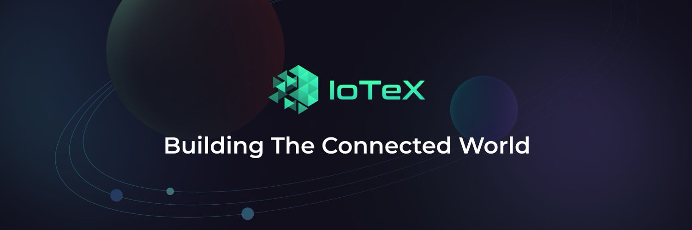

ioTube 是一个去中心化的跨链桥，可以在 IoTeX 和其他区块链网络之间实现加密货币（可替代/不可替代的代币）和数据的双向交换。第一个要支持的跨链网络是以太坊；您可以使用 ioTube 将以太坊上的 ERC20 资产（例如 ETH、WBTC、BUSD、UNI、PAXG）无缝转换为 IoTeX 上的 XRC20 资产。 IOTX 还与币安智能链 (BSC) 集成，我们计划增加对更多区块链（什么是区块链技术？是一种高级数据库机制，允许在企业网络中透明地共享信息。 区块链数据库将数据存储在区块中，而数据库则一起链接到一个链条中。 数据在时间上是一致的，因为在没有网络共识的情况下，您不能删除或修改链条。 因此，您可以使用区块链技术创建不可改变的分类账，以便跟踪订单、付款、账户和其他交易。）网络的支持，以增加 ioTube 的覆盖面和影响力。

