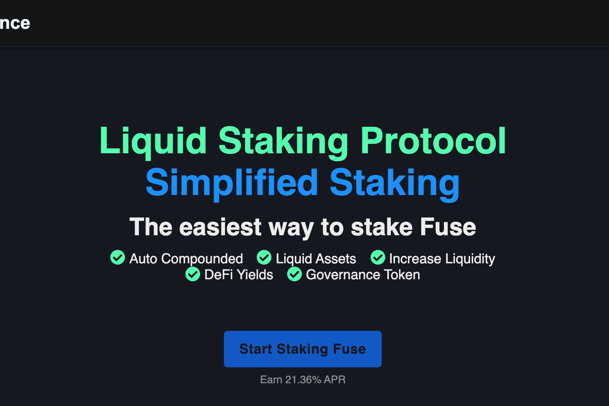

JinFinance 是一种基于 Fuse Network 的非托管流动性质押协议。您可以通过 JinFinance 协议质押您的 FUSE 代币，并获得可用于去中心化金融 (DeFi) 的“流动质押 FUSE”代币 (sFUSE)。
JinFinance 通过使您能够使用您的质押资产在收益之上获得收益，从而提供更多机会。使用您质押的代币作为抵押品，用于借贷、收益耕作、交易流动性等。
初始农场矿池从区块 14891530 开始上线。存入我们的 sFUSE 矿池进行单桩农业，以从网络奖励和 vJIN 代币奖励中赚取 FUSE。

