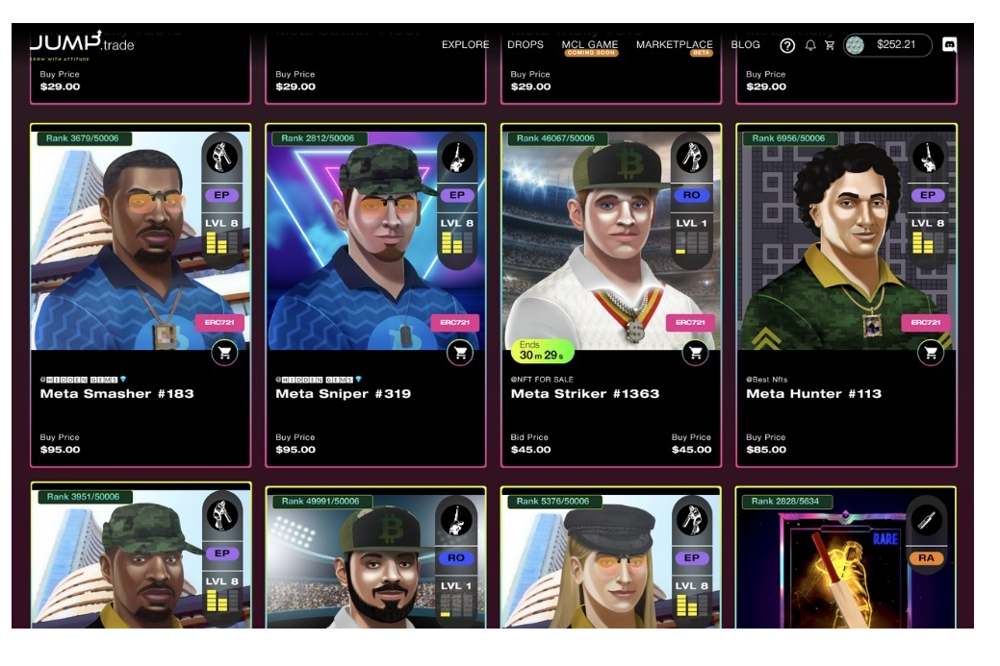

Jump.trade 是一个优质的 NFT 市场，在以游戏、品牌和国际艺术家为特色的独一无二的生态系统中提供独家 NFT 收藏。展开具有全球影响力的 NFT。
作为最初的发布，Jump 放弃了世界上第一个 P2E 板球比赛 NFT 集合，来自 Meta Cricket League NFT 的 55,000 个 NFT，在 9 分钟内售出。不仅如此，Cricket 游戏 NFT 掉落，展开 Meta Cricket League，全球首个 P2E Cricket NFT 游戏。因此，实现了巨大的元可能性。
同样的观点，Jump.trade NFT 市场移动应用程序的设计，使系统更加直观、可访问和易于导航。该应用程序符合最高安全标准，并且设计符合移动设备的最佳实践应用平台。
请注意，该应用程序仅用作交流和信息的平台，而不是任何形式的交易。

