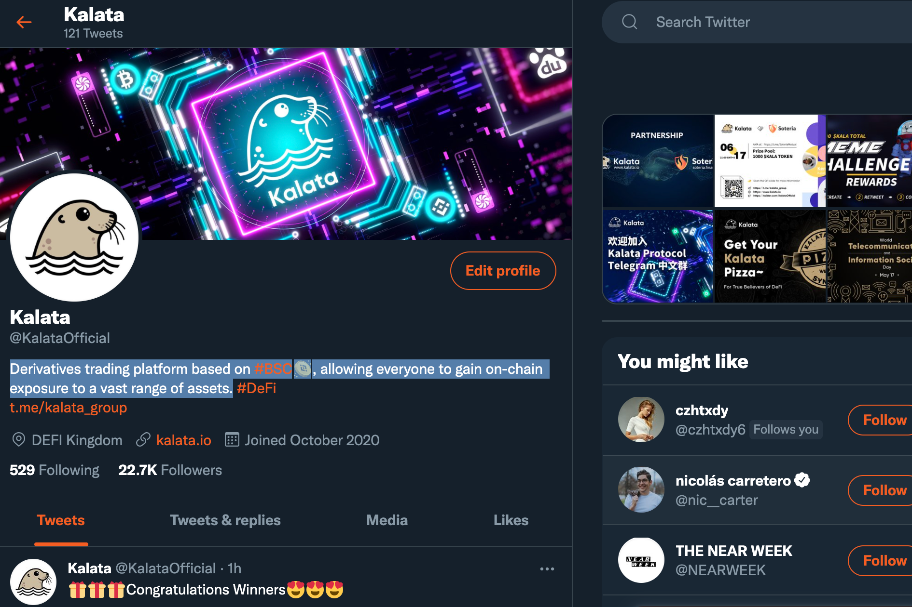

Kalata 协议 (KALA) 是一种合成资产协议。 Kalata 第一版可以实现与股票价格的 1:1 挂钩，让传统金融界的用户以更低的成本学习 Defi。不需要复杂的过程。用户只需将他/她的去中心化钱包连接到 Kalata DApp 即可交易全球主流资产，如 Tsla.US、BIDU.US、Coin.US、道琼斯、ARKK (ARK Innovation ETF)、SPCE.US ( Virgin Galactic Holdings Inc）、PACB.US（Pacific Biosciences of California）等。这是一个非常激动人心的创新。 Kalata 希望 Defi 不仅仅是像极客那样的一小部分人的游戏玩具。 Kalata 是传统金融交易者进入 Defi 世界的第一步。 Kalata 将帮助越来越多的用户探索未来金融的主要形态，使 Defi 成为主流。

