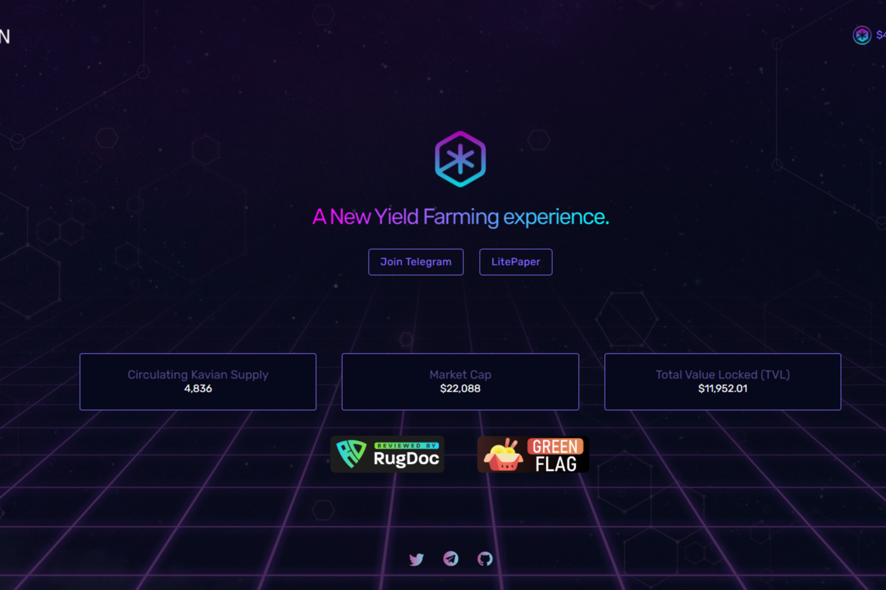

这是一个长期的事情，我们知道罗马不是一天建成的，道路很艰难，我们知道前方有很多问题，但如果我们设法解决这些问题，剩下的就是成功。我真的相信问题只是看待机会的另一种方式，这就是为什么我们决定使用 Kavian 这个名字，这几乎是一个发明词，使用一个我们可以适应其他网络的名字，一个我们可以通过多种方式升级的名字，不仅拥有许多网络上的许多农场项目，我们有机会将这个名称用于很多事情，比如我们自己的交换、桥接，或者谁知道，甚至是游戏和网络。

