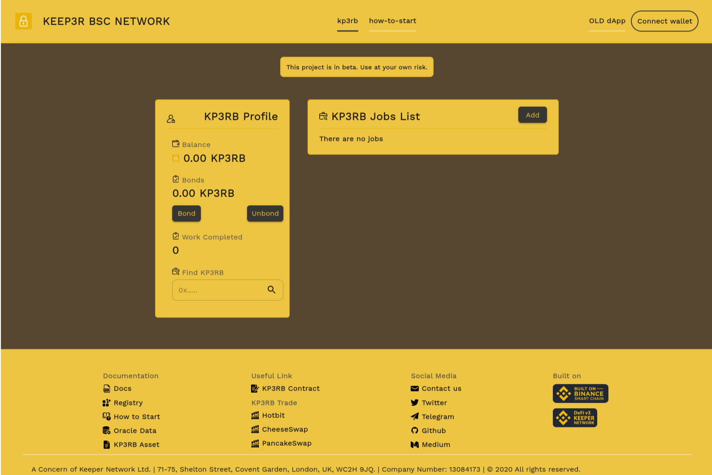

Keep3r BSC Network是币安智能链上第一个去中心化的keeper网络项目。

开发人员角色高度专业化，很难找到合适的人选。 @kp3rb 使用 NSC 网络上的自由平台解决了将项目与开发人员联系起来的问题

有几种不同的方法可以在 2021 年增加你的加密货币持有量。你可以购买、交易、质押，如果你是一个不择手段的低等人，你甚至可以通过黑客和诈骗来窃取它。但是，如果您没有资金和想法，还有更安全且完全合法的方法，因为还有另一种方法可以积累这些 satoshis：您可以赚取它。

