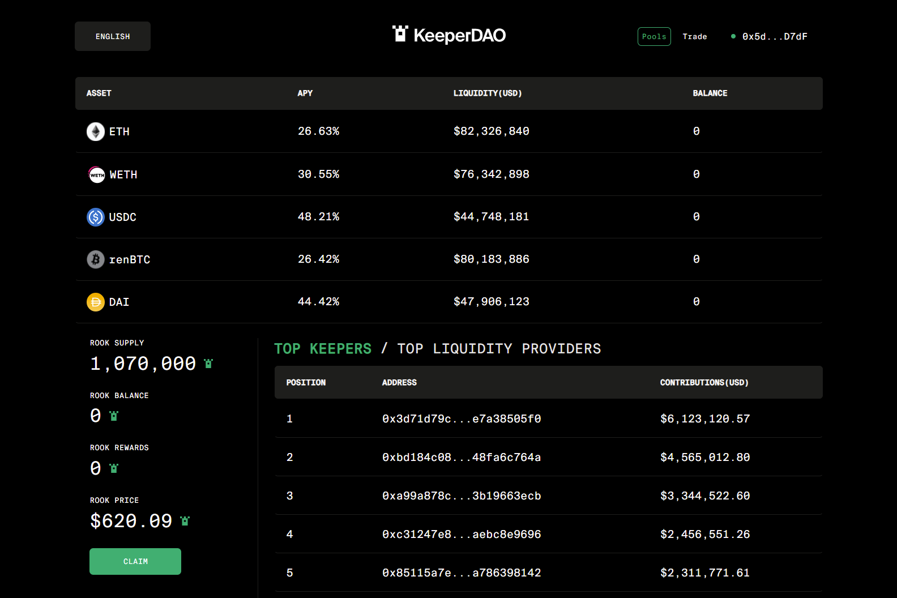

流动性支持
KeeperDAO 通过充当代理波动性基金来扩展 DeFi，为链上借贷和合成资产协议提供支持流动性。
长凸度
通过在市场波动和困难时期抓住套利机会来获得超额回报。
博弈论最优性
通过激励的链上合作，守护者能够比单个参与者获得更多的利润，支付更少的燃料，并抓住更多的机会。

Rook 独特的订单流去中心化支付 (DePFOF) 协议让您为您创造的价值付费，而不会在此过程中破坏以太坊网络。

