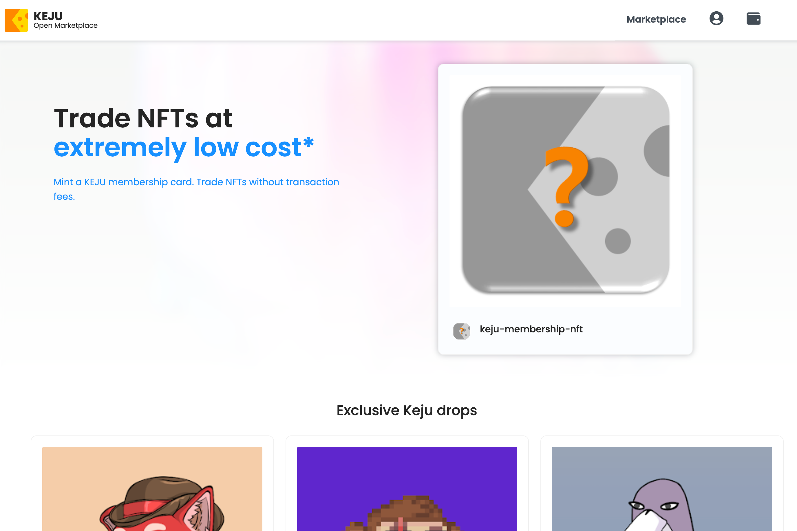

我们是来自世界各地的 NFT 爱好者。我们希望建立一个基于会员的 NFT 市场来降低交易成本。
KEJU会随着成员的不断增加，逐渐演变成一个社区拥有的去中心化组织。随着时间的推移，所有权变得不那么集中。
前期为了保护生态，我们会保留一定比例的选票。我们估计，到 2022 年底，该公司将不再拥有多数票。

KEJU 是一个会员制的 NFT 市场。您可以以极低的成本交易 NFT！并且没有会员卡的交易费用！

当然，我们的会员卡是 NFT。

