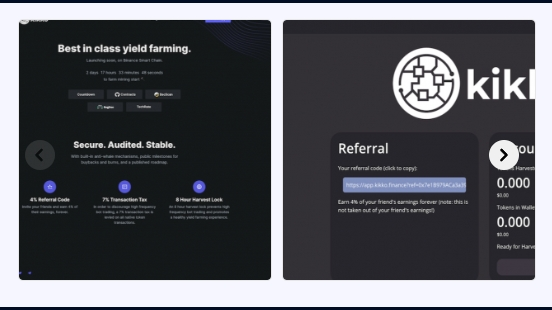

---
title: "Kikko Finance"
description: "安全的。已审核。稳定的。
具有内置的反鲸鱼机制、回购和销毁的公共里程碑以及已发布的路线图。"
date: 2022-8-21T00:00:00+08:00
lastmod: 2022-8-21T00:00:00+08:00
draft: false
authors: ["boogArno"]
featuredImage: "kikko-finance-1.png"
tags: ["DeFi","Kikko Finance"]
categories: ["nfts"]
nfts: ["DeFi"]
blockchain: "BSC"
website: "https://dappradar.com/deeplink/7266"
twitter: ""
discord: ""
telegram: ""
github: "https://github.com/kikkofinance"
youtube: ""
twitch: ""
facebook: ""
instagram: ""
reddit: ""
medium: "http://kikkofinance.medium.com/"
steam: ""
gitbook: ""
googleplay: ""
appstore: ""
status: "Live"
weight: 
lightgallery: true
toc: true
pinned: false
recommend: false
recommend1: false
---
Kikko Finance 采用基于币安智能链的稳定收益农业策略，具有增强的安全功能。 耕作于 2021 年 6 月 9 日星期三上午 7 点（太平洋时间）开始在我们的网站上查看块倒计时公平发布 — 没有预售或预挖！加入我们 Telegram 组的 1000 多名成员安全的。已审核。稳定的。具有内置的反鲸鱼机制、回购和销毁的公共里程碑以及已发布的路线图。*Kikko Finance*是什么？... *Kikko Finance*采用基于币安智能链的稳定收益农业策略，具有增强的安全功能。.*Kikko Finance 的*推文... 伟大的团队努力工作。很快在 CMC 和 CG 上市。Apr 的游泳池和农场仍然非常好，现在购买的价格也很高。

