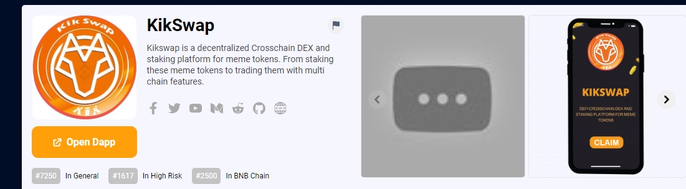

Kikswap 是第一个与 meme 代币挂钩的多链质押协议。借助网络上的多链技术，其社区成员将能够在 kikswap 的质押池中质押任何 meme 代币。它将成为使用类似策略的所有 meme 货币的事实上的质押代币。 Kikswap 代币持有者还可以在 NFT 质押中获得可观的回报。*Kikswap*是币安智能链上的代币，拥有各种令人印象深刻的功能。这是一个独特的交换协议，让用户可以完全控制*Kikswap*是一个指定的跨链 DEX 和 meme 代币的质押平台。从质押这些 meme 代币到使用多链功能进行交易。*Kikswap*是第一个与 meme 代币挂钩的多链质押协议。借助网络上的多链技术，其社区成员

