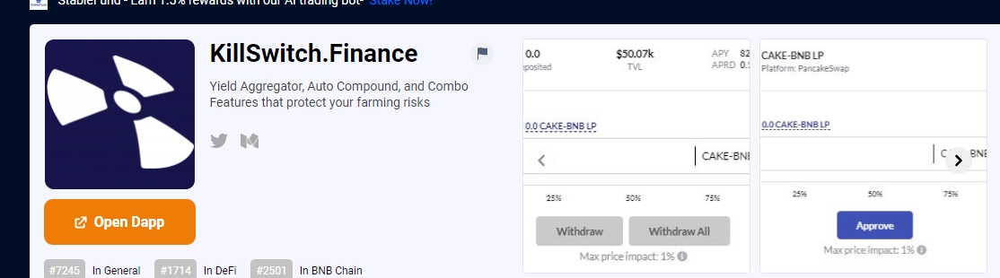

KillSwitch 是一个智能单产农业聚合器，旨在提高单产农民的便利性和安全性。用户可以自由地取消抵押，从他们的资金中提取流动性头寸，并一键立即出售他们的高风险代币。
特点：&nbsp
1. 一键质押- 只需输入想要的BUSD或BNB，系统会自动为您设置农场。
2. Kill Position (Withdraw All) - 一旦你想停止耕种，只需点击这个，系统就会撤回并出售LP。作为回报，您将以 BUSD 或 BNB 取回您的资金
3. 自动复合- 获得奖励后，系统会进行销售和复合，让您的港口不断增长

