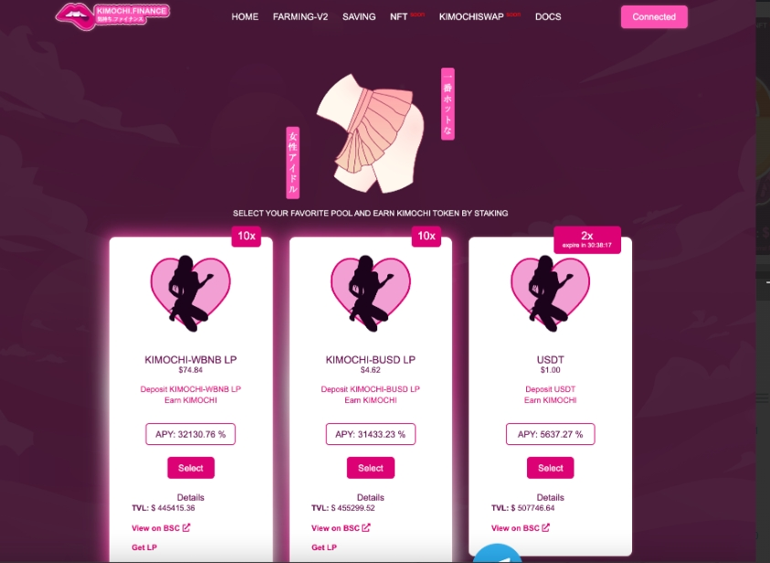

---
title: "Kimochi"
description: "Kimochi Finance 是一个与 DeFi 应用程序完全集成的平台，为用户带来最大的利润。"
date: 2022-08-21T00:00:00+08:00
lastmod: 2022-08-21T00:00:00+08:00
draft: false
authors: ["boogArno"]
featuredImage: "kimochi.png"
tags: ["DeFi","Kimochi"]
categories: ["nfts"]
nfts: ["DeFi"]
blockchain: "BSC"
website: "https://dappradar.com/deeplink/5682"
twitter: "https://twitter.com/KimochiFinance"
discord: ""
telegram: "https://t.me/KimochiGroup"
github: "https://github.com/kimochi-finance"
youtube: ""
twitch: ""
facebook: ""
instagram: ""
reddit: ""
medium: ""
steam: ""
gitbook: ""
googleplay: ""
appstore: ""
status: "Live"
weight: 
lightgallery: true
toc: true
pinned: false
recommend: false
recommend1: false
---
从金融界的“胜利之情”到日本成人视频（JAV）的压倒性感情 – Kimochi  Kimochi Finance 是一个与 DeFi 应用程序完全集成的平台，为用户带来最大的利润。日文kimochi是泡菜是一种“感觉”。这种感觉通常是由某种刺激引起的，是一种非持久的感觉状态。Kimochii （带有长 -ii 音）的意思是“感觉良好”。*Kimochi*用于描述一种情绪状态，一种反思和非理性的感觉，一种无法控制的情绪，尤其是浪漫的感觉。

