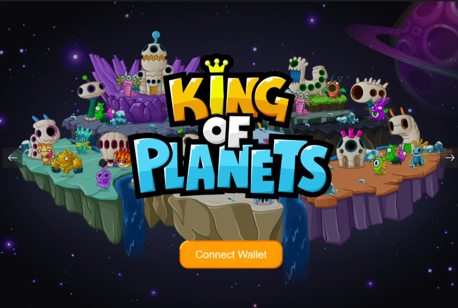

King of Planets 是一款基于区块链的 P2E（Play-to-Earn）游戏，包含 NFT、DeFi 2.0 和 GameFi。它是在 Klaytn 网络上创建的，用户可以赚取和花费 $KOP。外星人有自己的外貌、等级和等级。拥有Alien的用户可以通过&nbsp;1）NFT Farming，2）PVP Battle，3）Boss Raid等各种内容享受游戏并获得奖励。没有 Aliens 的用户也可以通过在 DeFi 2.0 模型中创建的 $KOP Pool 中质押来享受星球之王并获得奖励。如果拥有 Alien 的用户参与 $KOP Staking，可以增强 Aliens Hash Power。这样做，它将对各种活动产生积极影响，不仅是 DeFi 模型，还有 NFT Farming、PVP Battle 等。

