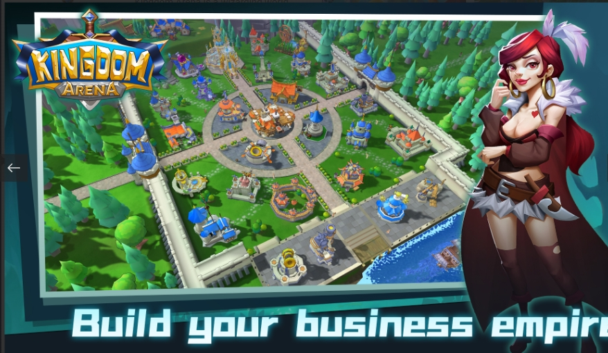

王国竞技场是一个&nbsp;向导&nbsp;世界模拟和&nbsp;冒险&nbsp;战斗&nbsp;Play-to-Earn&nbsp;游戏。结合城镇建设、英雄冒险、宠物养殖、贸易和海战、矿山开采、宴会等等。Kingdom Arena是游戏的主要 PvP 模式，玩家可以使用他们的[Cookie]团队与其他玩家的团队作战。击败其他玩家会奖励奖杯，确定玩家的等级，以及胜利勋章，可在勋章商店兑换贵重物品和[灵魂石]。 每个王国竞技场赛季持续 4 周。在竞技场赛季中达到大师段位会奖励该赛季独有的[装饰品，而] [水晶])和胜利勋章会在赛季结束时根据玩家的段位获得奖励。

