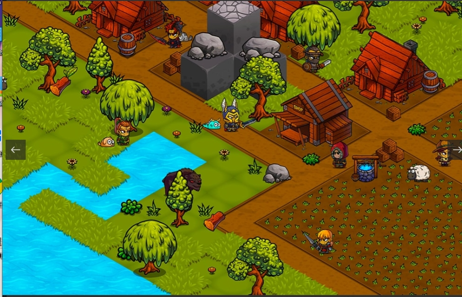

Kingdoms Beyond 是一款免费的开放世界 MMORPG，可以直接从您的浏览器中播放。收集英雄，继续任务，结交新朋友。从英雄到物品，您收集和赚取的稀有资产都有区块链的支持。发现一个由其用户构建和管理的开放世界。继续任务并结交新朋友。与来势汹汹的世界首领战斗以获得史诗般的奖励。收集资源并建立你的王国。从英雄到物品，您收集和获得的稀有资产都有区块链支持。每个英雄都有不同的外观。随着英雄的升级，他们可以使用不同的动作来帮助他们完成旅程。某些英雄可能会进化，升级他们的盔甲、基础属性并获得新的能力！

