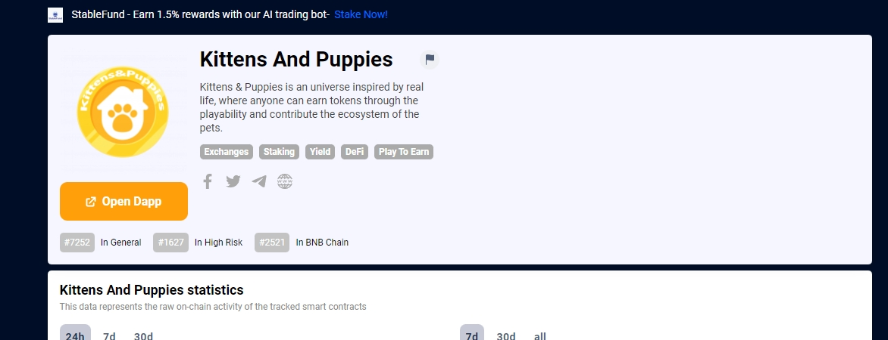

伴侣动物在社会中发挥着重要作用。因此，我们决定给予它们应有的关注，因为它们对人们产生的影响，从与宠物一起生活产生的问题，到它们在个人和社会层面提供的好处。 Kittens＆Puppies 是一个受现实生活启发的宇宙，任何人都可以通过可玩性赚取代币并为宠物的生态系统做出贡献。玩家将能够玩耍、饲养和复制他们的 NFT 宠物。我们的目标是分几个阶段开发游戏，倾向于创造一个动态游戏的最佳组合，每个玩家都可以选择他们喜欢的宠物以及与他们中的哪些宠物长期产生更高的收益，它还设计有一个最新的区块链技术：NFT，考虑到玩家的游戏体验和玩赢机制是我们的首要任务。最初移动设备是我们的主要目标，但从中期来看，它将实现在网络上播放，这样每个玩家都可以在任何地点、任何时间玩 Kittens&Puppies，并且始终将手机连接到互联网。

