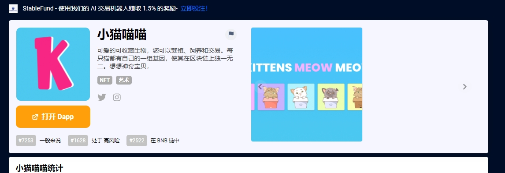

---
title: "Kittens Meow Meow"
description: "可爱的可收藏生物，您可以繁殖、饲养和交易。每只猫都有自己的一组基因，使其在区块链上独一无二。想想神奇宝贝,"
date: 2022-08-21T00:00:00+08:00
lastmod: 2022-08-21T00:00:00+08:00
draft: false
authors: ["boogArno"]
featuredImage: "kittens-meow-meow.png"
tags: ["High risk","Kittens Meow Meow"]
categories: ["nfts"]
nfts: ["High risk"]
blockchain: "BSC"
website: "https://dappradar.com/deeplink/13087"
twitter: "https://twitter.com/kreaturesnft"
discord: ""
telegram: ""
github: ""
youtube: ""
twitch: ""
facebook: ""
instagram: "https://www.instagram.com/kreaturesnft/"
reddit: ""
medium: ""
steam: ""
gitbook: ""
googleplay: ""
appstore: ""
status: "Live"
weight: 
lightgallery: true
toc: true
pinned: false
recommend: false
recommend1: false
---
可爱的收藏品 &nbsp;您可以繁殖、饲养和交易的生物。每只猫都有自己的一组基因，使其在区块链上独一无二。想想神奇宝贝，但更可爱。可爱的可收藏生物，您可以繁殖、饲养和交易。每只猫都有自己的一组基因，使其在区块链上独一无二。想想神奇宝贝，Kreatures 平台将提供多种类型的游戏，并为用户赚取自定义角色。Kreatures 生态系统中的每款游戏都将直接与 Kreatures 代币和 NFT 奖励市场相关联，从而为用户、玩家和投资者提供无限的策略来赚取收益。

