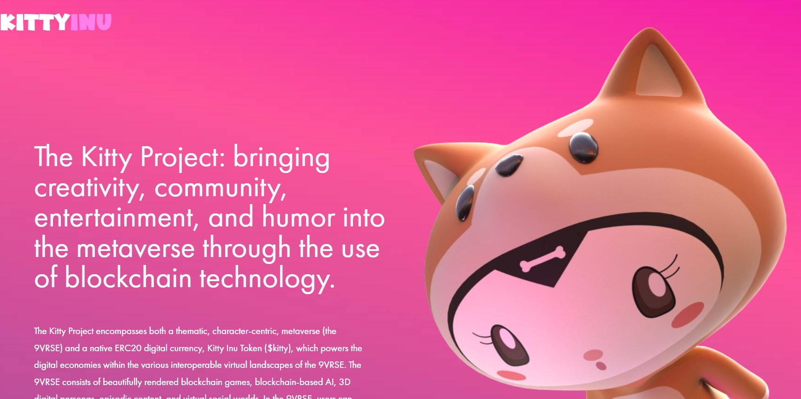

---
title: "Kitty Inu"
description: "嗨，小猫！请在我们的新官方推特上关注我们！"
date: 2022-08-21T00:00:00+08:00
lastmod: 2022-08-21T00:00:00+08:00
draft: false
authors: ["boogArno"]
featuredImage: "kitty-inu.png"
tags: ["NFT Games","Kitty Inu"]
categories: ["nfts"]
nfts: ["NFT Games"]
blockchain: "ETH"
website: "https://dappradar.com/deeplink/11490"
twitter: ""
discord: "https://discord.com/invite/kittyinu"
telegram: ""
github: ""
youtube: ""
twitch: ""
facebook: ""
instagram: ""
reddit: ""
medium: ""
steam: ""
gitbook: ""
googleplay: ""
appstore: ""
status: "Live"
weight: 
lightgallery: true
toc: true
pinned: false
recommend: false
recommend1: false
---
镇上有一只新的狗狗。 Kitty 是一种游戏和 NFT DeFi 协议，为 Play-to-Earn 和 Metaverse 生态系统提供动力。Kitty 的使命是建立最好的社区驱动的游戏和 NFT&nbsp;Defi 协议，并由 Defi 中最好的团队之一提供支持。部分 Kitty，部分 Inu，Kitty Inu 将向月球发出呜呜声和喵叫声。Kitty 项目包括主题、以角色为中心的元宇宙（9VRSE）和原生 ERC20 数字货币 Kitty Inu 代币（$kitty），它为 9VRSE 的各种可互操作虚拟环境中的数字经济提供动力。9VRSE 由精美渲染的区块链游戏、基于区块链的人工智能、3D 数字角色、情节内容和虚拟社交世界组成。在 9VRSE 中，用户可以通过使用 Kitty Inu 代币来播放、体验、探索和货币化他们的内容

