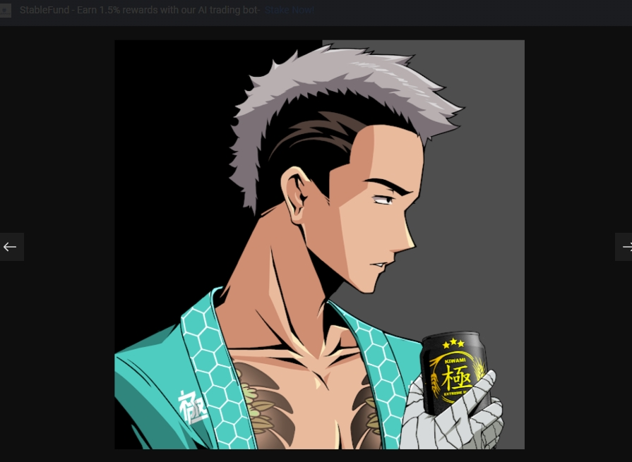

Kiwami 是一个包含 10,000 个化身的集合，适用于下一代艺术家、建设者和打破规则者的集体。精心设计的元节 &amp;出生在日本的持有者可以获得独家的 Kiwami 产品，并有机会塑造我们共同的未来。加入我们追逐海啸的行列。天国俱乐部位于东京涩谷的破败腹地。Kiwami 传说中的每个角色都出现在俱乐部。无论他们是在离开舞池后挂在露台上，还是在酒吧与崛起的黑帮追随者混在一起，沉浸在脉动的节拍和引人入胜的合成波中，喷涂他们所属的标志，或者只是充当俱乐部保镖；天国俱乐部找到了一种将他们团结起来的方法。富人或穷人，工匠或工薪阶层；俱乐部摆脱了所有的自负。他们可能没有意识到这一点，但他们的故事和生活很快就会以他们从未想象过的方式交织在一起。

