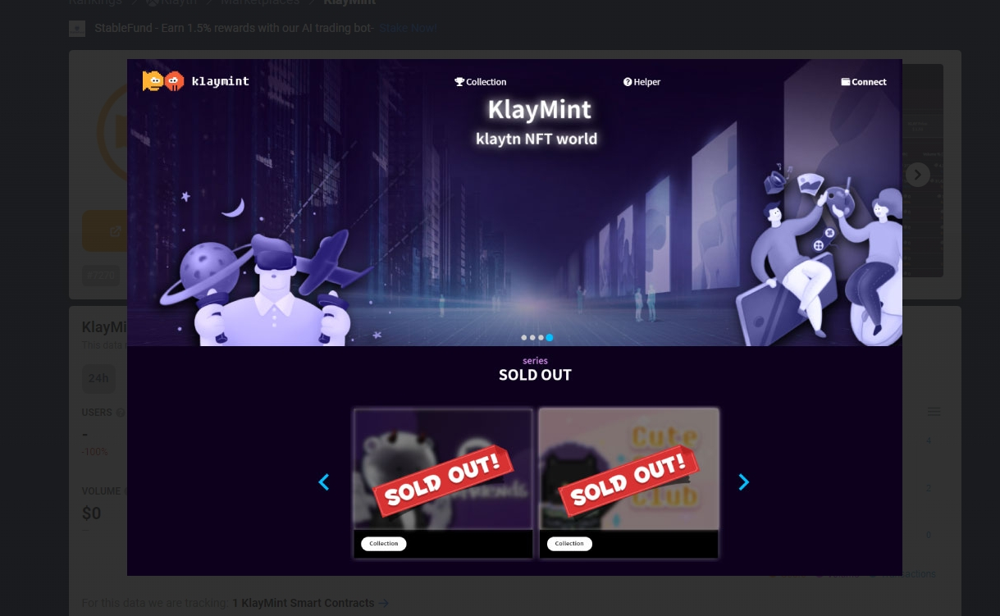

---
title: "KlayMint"
description: "Klaytn NFT 铸币公共平台‘KLAYMINT’"
date: 2022-08-21T00:00:00+08:00
lastmod: 2022-08-21T00:00:00+08:00
draft: false
authors: ["boogArno"]
featuredImage: "klaymint.png"
tags: ["Marketplaces","KlayMint"]
categories: ["nfts"]
nfts: ["Marketplaces"]
blockchain: "Klaytn"
website: "https://dappradar.com/deeplink/11342"
twitter: "https://twitter.com/klaymint"
discord: ""
telegram: ""
github: ""
youtube: ""
twitch: ""
facebook: ""
instagram: ""
reddit: ""
medium: "https://klaymint.medium.com/"
steam: ""
gitbook: ""
googleplay: ""
appstore: ""
status: "Live"
weight: 
lightgallery: true
toc: true
pinned: false
recommend: false
recommend1: false
---
KlaymMint 是一个 NFT 开放平台，提供基于 Klaytn 链的 NFT 铸币（销售）/购买/投资/交易服务。
在 KlayMint 中使用 NFT 铸币服务时，您可以选择“稀有度（等级）”选项，项目/公司可以通过 Klaytn 链内的 KlayMint 快速、低费用地铸币 NFT 卡来推广他们的服务，并通过 NFT 等应用游戏/元界，我们可以在各种新的业务领域共同成长。艺术家和作家可以通过发行 NFT 卡来引领新的商品市场，而用户可以通过参与 NFT 铸币来参与项目/公司服务和促销，并将其用作娱乐/投资。

