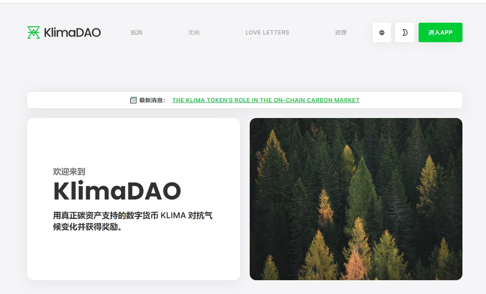

---
title: "KlimaDao"
description: "介绍 $KLIMA — 一种算法碳支持的加密货币"
date: 2022-08-21T00:00:00+08:00
lastmod: 2022-08-21T00:00:00+08:00
draft: false
authors: ["boogArno"]
featuredImage: "klimadao.png"
tags: ["Social","KlimaDao"]
categories: ["nfts"]
nfts: ["Social"]
blockchain: "Polygon"
website: "https://dappradar.com/deeplink/16817"
twitter: "https://twitter.com/KlimaDAO"
discord: "https://discord.com/invite/klimadao"
telegram: ""
github: ""
youtube: "https://www.youtube.com/c/klimadaofinance"
twitch: ""
facebook: ""
instagram: ""
reddit: ""
medium: ""
steam: ""
gitbook: ""
googleplay: ""
appstore: ""
status: "Live"
weight: 
lightgallery: true
toc: true
pinned: false
recommend: false
recommend1: false
---
使用由真实碳资产支持的数字货币 KLIMA 对抗气候变化并获得奖励。KlimaDAO 是新绿色经济的中心。 KlimaDAO 建立在节能的 Polygon 网络之上，使用一系列技术来减少市场分散化，并加速向全球可持续发展项目提供气候融资。DAO 出售债券并向所有KLIMA 持有者分配所得奖励。我们出售的每一张债券都会为不断增长的绿色国库助力，或提高关键环境资产的流动性。人类和地球的双赢。*KlimaDAO*是对抗气候变化的 DeFi ...... *KlimaDAO*是新绿色经济的中心。*KlimaDAO*建立在节能的 Polygon 网络上，使用

