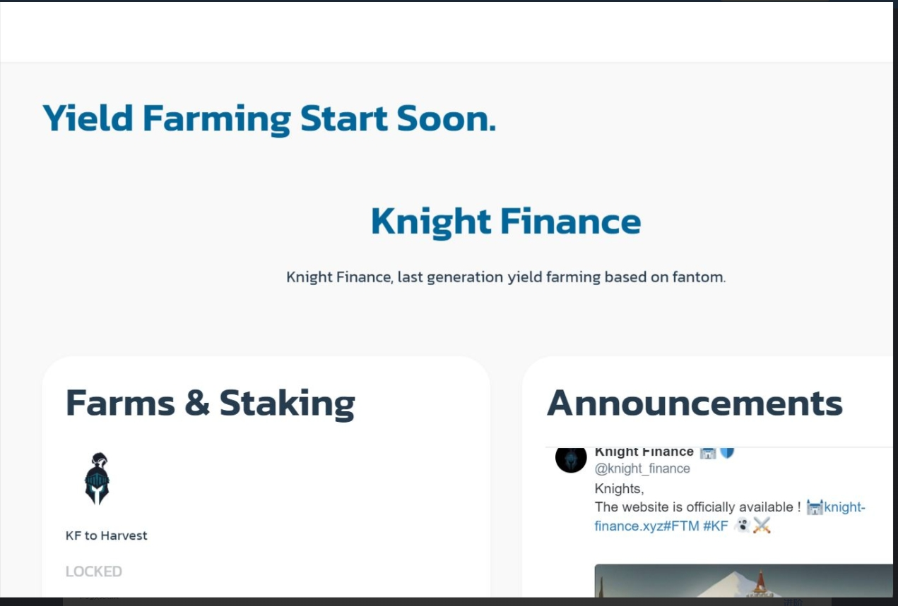

Fantom区块链即将推出一个新的有趣的农业项目作为骑士，您将能够每周在多个城市进行耕种（新的收益农场将定期添加）并使用我们的 $KF 代币进行游戏。一个应用程序将在启动时就可以开始播放了。更多有趣的应用程序和游戏正在开发中。我们想让 Knight Finance 成为 Fantom 上排名第一的娱乐项目。Knight 在 Fantom 区块链上资助了一个有趣的新单产农业项目。KnightSwap 是币安智能链 (BSC) 上卓越的去中心化交易所 (DEX)，旨在实现可靠和可持续的收益，同时提供最高

