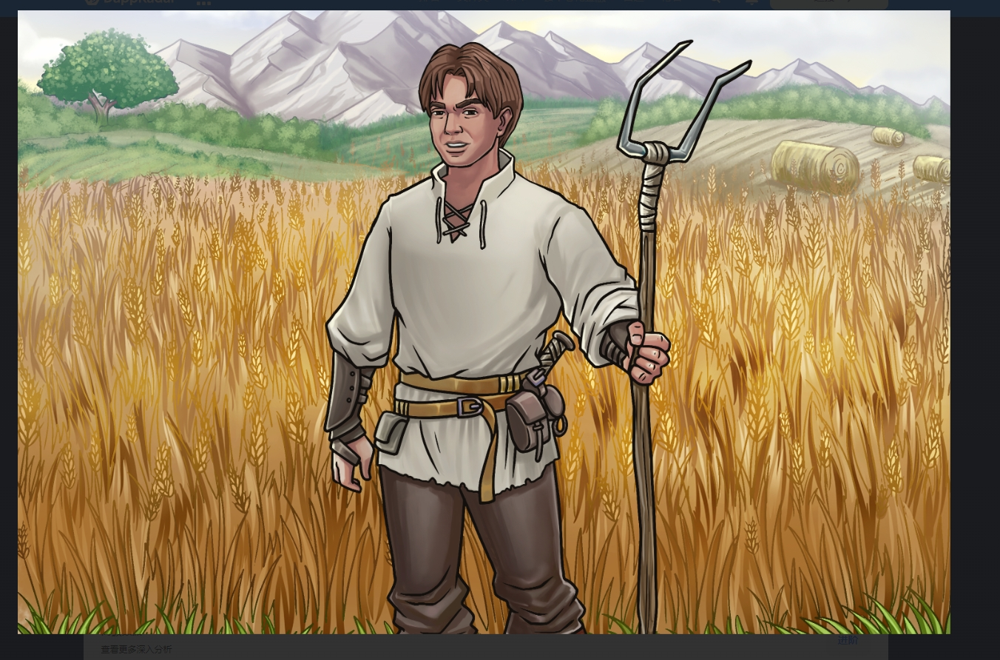

骑士与Peasants 是一款建立在 Harmony 区块链上的中世纪主题 RPG 放置类游戏。它支持一系列功能，例如：单一抵押（银行）、市场、收益农场、托管服务，当然还有 Knight 和 Peasant NFT，它们具有一系列不断扩展的效用。Knights & Peasants 是一款建立在 Harmony 区块链上的以游戏为目的、以中世纪为主题的 RPG 放置游戏。Knights & Peasants 是一款建立在 Harmony 区块链上的休闲模拟器游戏。即将来到 ETH / Polygon！ 

