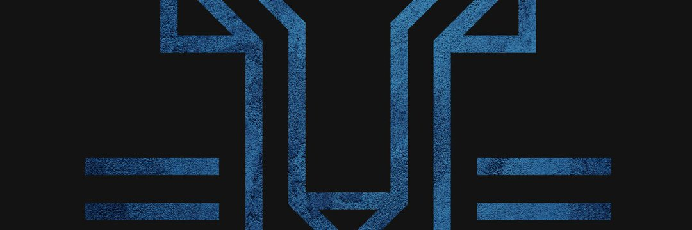

KODX 用于质押、借贷、借贷的新网关建立在 TRON 区块链上，最大供应量为 33K

KODX 是一种去中心化的金融聚合协议，可同时提供多种质押和借贷产品。 KODX 将被设置为...

$KODX 新网关，用于在 Tron 上进行抵押、借贷和借入稳定币......我们落后于宣布推出#KODX NFT
KING OF DEFI 是一个基于 TRON 区块链的数字金融项目。它为用户提供了质押、借贷和治理能力。KODX 是一种去中心化金融聚合协议，可同时提供各种质押和借贷产品。 KODX将作为抵押品借入稳定币如TRC20-USDT、USDJ。

