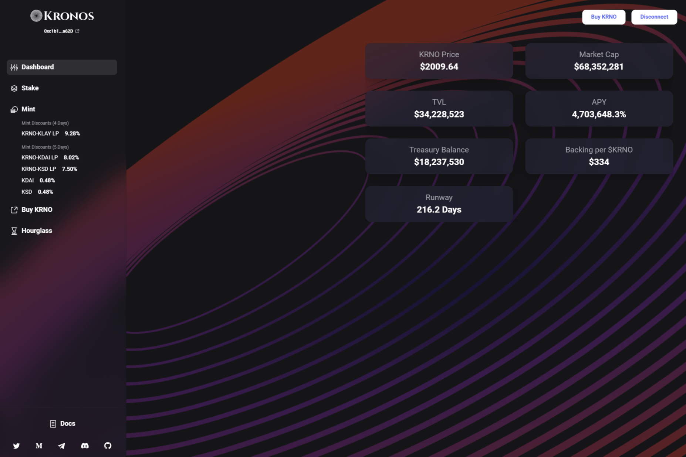

Kronos DAO 是 Klaytn 链上第一个基于 KRNO 代币的去中心化储备货币协议。每个 KRNO 代币都由 Kronos DAO 国库中的一揽子资产（例如 KDAI、KRNO-KDAI LP 代币等）支持，赋予其不可低于的内在价值。 Kronos DAO 还通过质押和铸币将经济和博弈论动态引入市场。

Kronos DAO 是 Klaytn 链上第一个基于 KRNO 代币的去中心化储备货币协议。一种去中心化的储备货币协议，也称为 Defi2.0，通过协议拥有的流动性运作。
每个 KRNO 代币都由 Kronos DAO 国库中的一揽子资产（例如 KDAI、KRNO-KDAI LP 代币等）支持，赋予其不可低于的内在价值。
您可以通过质押或铸币参与 Kronos DAO。基于经济和博弈论动态，这两种策略在市场上创造了一个正和的环境。
※ 什么是储备货币？又称实体经济中的关键货币，是中央银行或主要金融机构持有的用于国际交易的货币。

