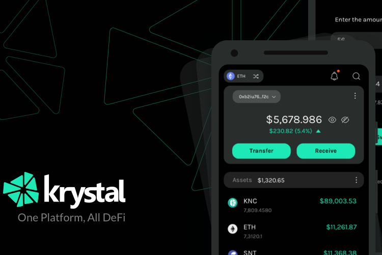

Krystal 是一个多链平台，可简化对流行 DeFi 服务的访问和管理 NFT。交换代币、赚取被动收入、管理您的投资组合、从我们的奖励计划中受益并在我们的社区启动板 (KrystalGO) 上参与代币发布。现在支持 10 个区块链网络上的服务。

Krystal DeFi 是一个多链平台，可让您轻松访问流行的 DeFi 服务并管理您的 NFT 投资组合。 Krystal 为用户带来最好的...

*Krystal* 允许您创建一个多链钱包（iOS 和 Android），您可以在其中存储、发送和接收 Solana 网络和其他...

