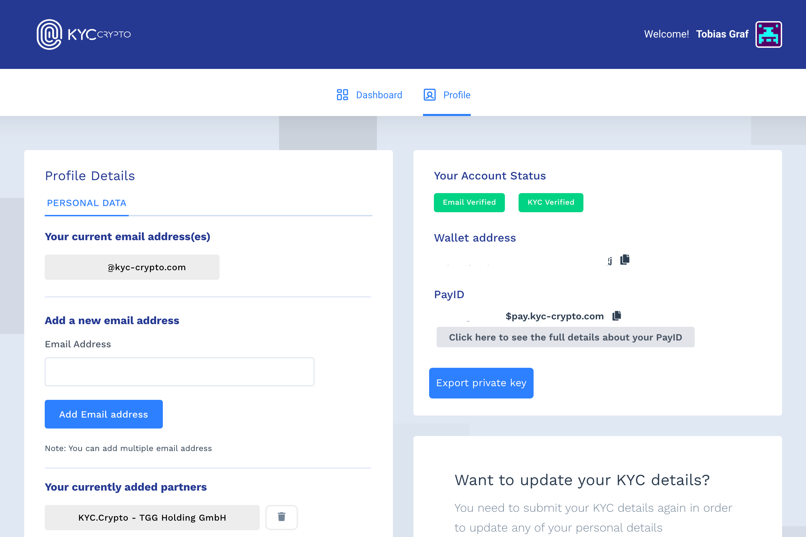

我们在 KYC.Crypto 为我们的用户提供了在多家银行、交易所和 KYC 相关服务上进行交易的设施，只需维护一个去中心化且全球保存的 KYC 档案。该配置文件可用于所有 KYC 相关服务和各种在线商店、软件提供商，并通过我们分散的 Single Sing-On 作为社交媒体验证。

为什么大多数加密货币交易所都必须进行 KYC？ — 了解您的客户 (KYC) 法规对于主要的加密货币交易所是强制性的，因为它...

