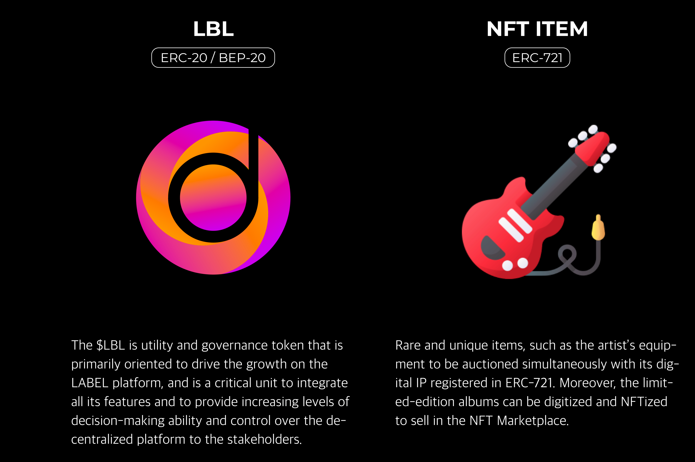

LABEL——下一代基于区块链的娱乐教育平台
LABEL 是建立在以太坊网络之上的无与伦比的 NFT 基础设施，由 LBL 实用程序和治理令牌提供支持，其统一目标是建立一个公平的利润分享生态系统，无需许可集成 IP 权利。 LABEL提供去中心化的P2P孵化平台，通过DAO投票系统投资世界级的娱乐教育内容，进一步让贡献者通过NFT持股机制获取收益。 LABEL平台构建了一个生态系统，建立了一个公平、去中心化的孵化体系，旨在为MOOC行业的内容创作者提供更便捷的知识产权投资、推广和分配渠道，从而改善不公平的利润结构，存在于该领域，努力防止整个行业的版权侵权案件。

