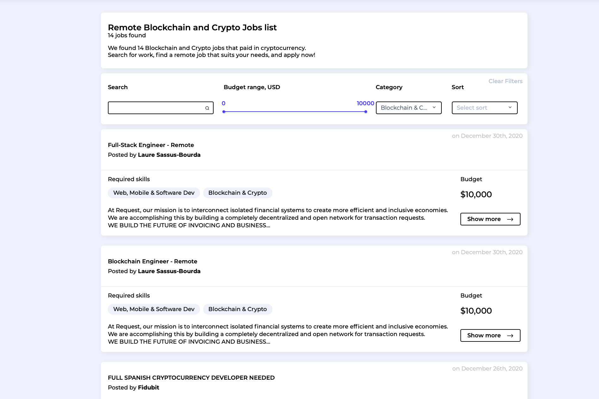

LaborX® 是一个基于区块链的自由职业平台，具有加密货币支付功能。
我们帮助客户和自由职业者建立联系，通过智能合约提供高效的区块链交易和强大的保护——无论您身在何处。
可选的第三方钱包集成（例如 MetaMask）使 LaborX 成为真正去中心化的应用程序，同时保持最佳的用户体验。

LaborX 是一个区块链工作平台，可帮助客户和自由职业者联系，通过智能合约提供高效的交易和强大的保护——无论您身在何处。

