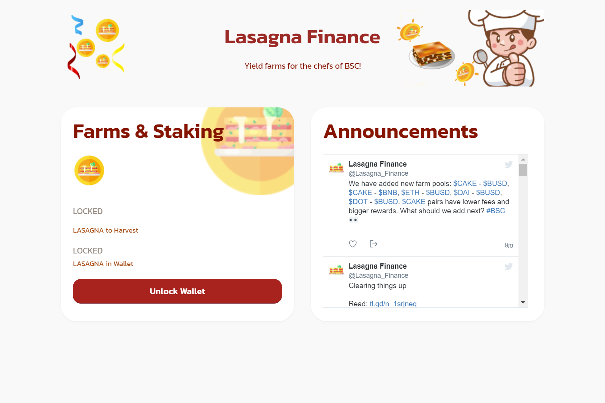

千层面金融
为 BSC 的厨师打造的农场！
质押LP代币赚取LASAGNA

帽子是烤宽面条金融？千层面金融。为 BSC 的厨师打造的农场！质押 LP 代币以赚取 LASAGNA。你怎么看这个页面...

Lasagna.finance 的 Alexa 全球排名为 544,962，在阿根廷排名第 7,806。自 3 个月前以来，其全球排名上升了 68,994 个职位。根据其估计的广告收入，Lasagna.finance 的估计价值为 158,099 美元。 Lasagna.finance 每天接待大约 5,775 名独立访客。其网络服务器位于美国华盛顿州西雅图市，IP 地址为 54.230.162.3。据 SiteAdvisor 称，lasagna.finance 无法访问。

