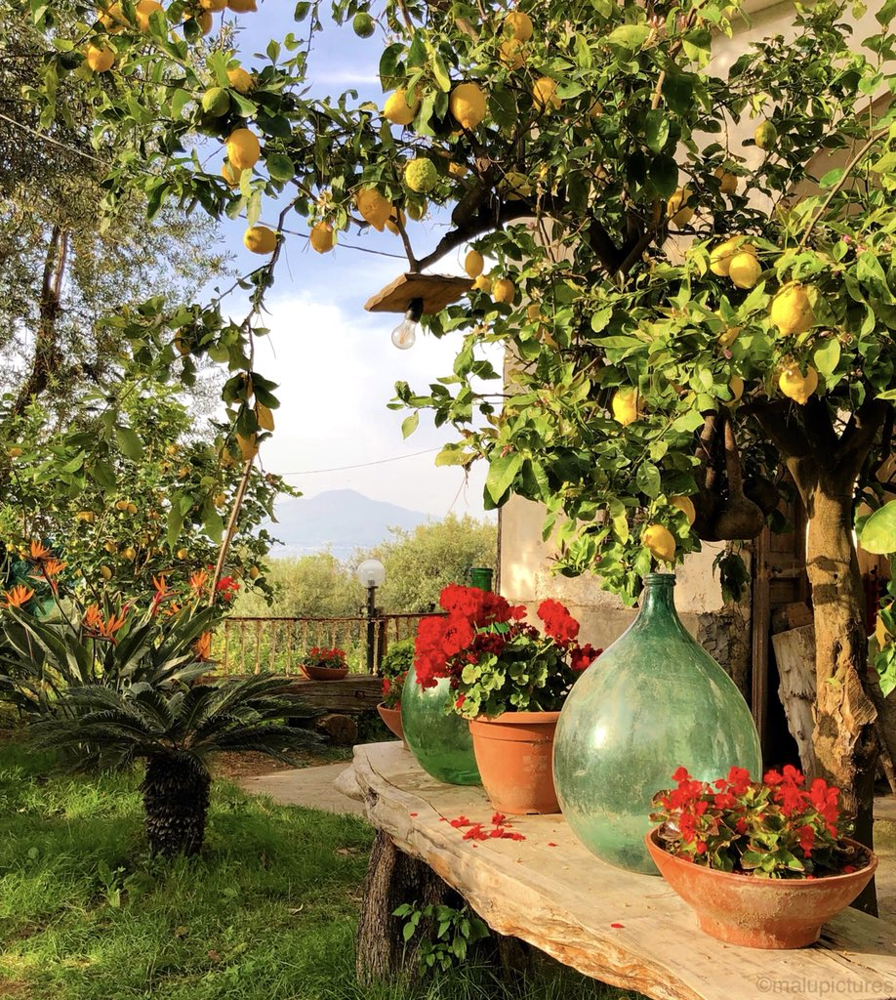

LemonFarm 是 Binance 智能链上全新的去中心化交易所，被称为第二代收益耕作机制，通过 AUDIT 和 Timelock 合约在发布时允许永久价格上涨和可持续且有利可图的耕作收益。
$LEMON 是一种通货紧缩代币，每笔交易消耗 1%！

参观#Sorrento 的柠檬农场🍋🍋🍋是#BestofItaly 之旅#bayofnaples #Italy #travel #lemonfarm #simplytrafalgar #td #loveSorrento #visitItaly 中最美丽、最有趣的体验之一

坐落在茂密的丘陵地带，非常适合大自然爱好者。Lemon Valley Farm Estate是一个工作农场，位于肯尼亚 Elementeita 的 Kasambara 茂密的山坡上。

在 Kikopey 和 Nakuru 镇之间的 Nakuru-Nairobi 高速公路上找到我们。我们在通往 Soysambu Conservancy 的路口对面，每个转弯处都有清晰的标志。

欣赏 Elementeita 湖的全景，用双筒望远镜轻松捕捉下方保护区内的野生动物。

