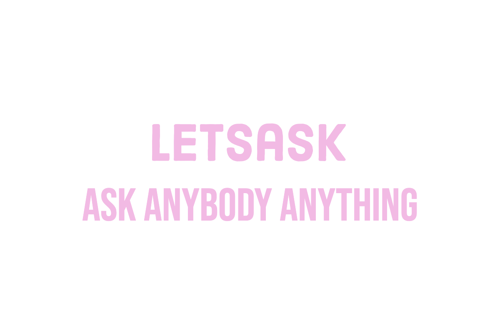

如果我说你可以（匿名）质疑某人并将其铸造为 NFT 并在公海出售，这一切都可以通过单击按钮完成。构建它的原因是质疑现状。现在，我们害怕质疑某人。即使我们质疑某人，也有办法从数字世界中删除内容，或者有办法识别这个人。使用区块链，没有人可以删除内容，也没有人可以标记这个人。由于它是完全上链的，因此内容作为 SVG 直接存储在区块链上，而不是元数据。内容未链接到任何集中式服务器，因此删除内容的可能性为零。