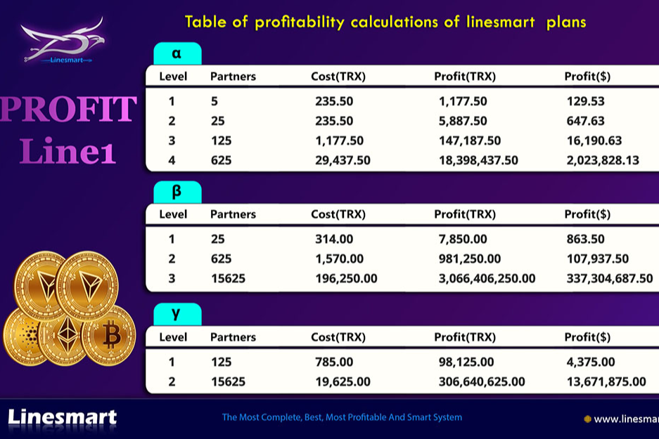

LINESMART 是全球去中心化生态系统的国际社区，也是 Tron 网络的第一个智能合约营销矩阵。这是一种自动执行的软件算法，执行在社区成员之间分配合作伙伴奖励的功能，受一定条件（矩阵营销计划）约束。

智能合约技术是现代去中心化经济中的一种新现象。
它允许根据程序代码处理和分配数字资产的资金流。
所有流程都在一个开放的、去中心化的区块链网络中进行。
基于 Tron 加密货币，其基础设施支持此类合约的操作。

