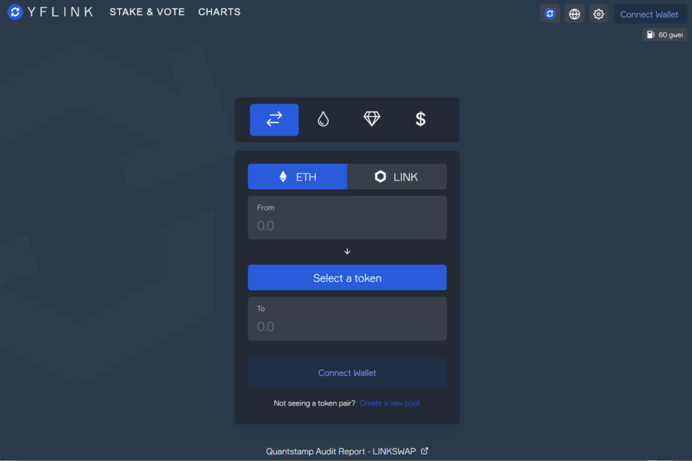

LINKSWAP 平台具有独特的功能，旨在解决我们这个时代第二代 AMM 面临的痛点——无论是对于 LINK 持有者，还是对于整个 DeFi 社区。一些主要功能包括 SlipLock，它是保护流动性提供者免受无常损失的解决方案和 RugLock，它是 LINKSWAP 防止地毯拉扯的解决方案之一。

LINKSWAP 是一个去中心化的自动化做市商，为 DeFi 领域带来了强大的额外功能，包括原生流动性锁定、无常损失......

