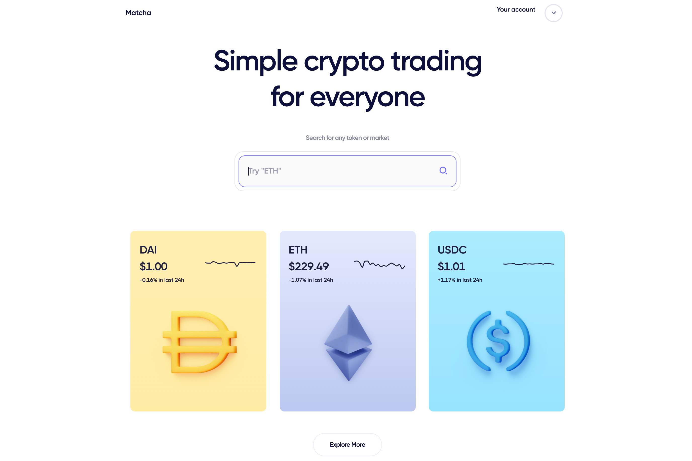

Matcha 是一个由 0x 提供支持的加密货币交易平台。我们是一个去中心化交易所，这意味着用户通过以太坊智能合约基础设施点对点交换他们的代币。

抹茶经过精心设计，非常易于使用。您的平均去中心化交易所具有陡峭的学习曲线，大多数人很难弄清楚。我们着手打造一个平易近人且易于使用的交易平台，它更像 Robinhood，而不是专业的订单簿交换。在幕后，Matcha 会在各种流动性来源中为您找到最优惠的价格，包括 0x、Kyber、Uniswap、Oasis、Curve 等。

