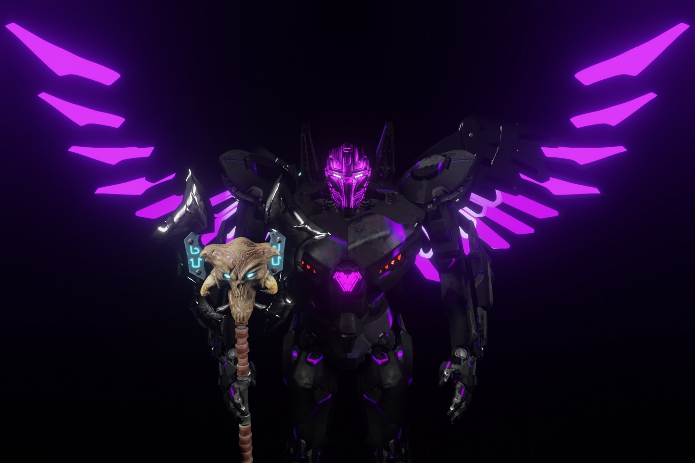

成为你的 NFT

您独特的 NFT 将是您在游戏中的可玩角色，该游戏将于 2022 年第三季度推出，并且已经开发了六个月。
玩赚
Meka Rim 将使用游戏即赚钱机制，允许玩家在玩游戏时赚取 $CORE 代币和 NFT。
质押
您将能够质押您的 NFT 并赚取 $CORE。代币经济学将在质押功能推出之前提供。
商品
我们将有一个会员专卖店，将在各个时间点解锁，提供限量版好东西。
社区
成为帮助游戏和 MekaRim 开发和指导的社区的一员。

